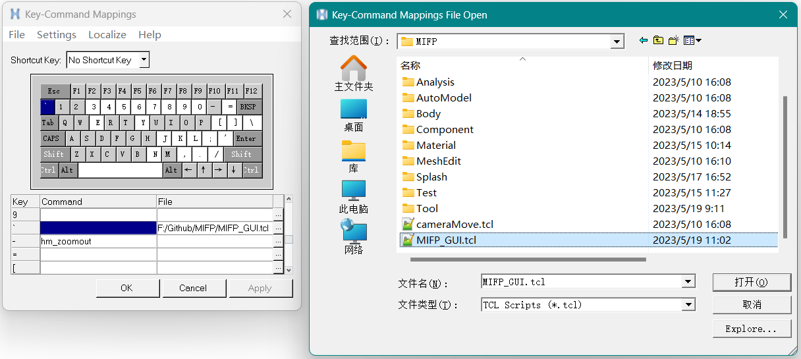
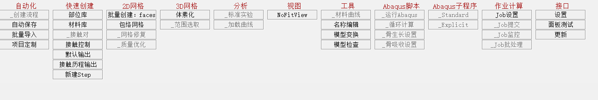

# MIFP

## 介绍
- 用于Hypermesh前处理的快速有限元建模平台，主要面向Abaqus
- 目标：提高有限元前处理自动化程度，摆脱"手工作坊"式工作流
- 状态：施工中(Work-in-progress)

***

## 版本

- Hypermesh2021
- Abaqus2021

***

## 功能列表

- [ ] 自动化建模
    - [ ] 创建流程
    - [ ] 自动保存
    - [x] 批量导入(.stl/.inp)
- [ ] 快速创建
    - [ ] 部位库
    - [x] 材料库
        - [x] 线弹性体
        - [x] 弹塑性体
        - [x] 超弹性体
        - [x] 其他材料
    - [x] 接触控制
    - [x] 默认输出(Abaqus)
    - [x] 接触历程输出
    - [x] 创建分析步(Static-Step)
- [ ] 2D网格
    - [x] 批量创建faces
    - [x] 包络网格
- [ ] 3D网格
    - [x] 体素化网格
- [ ] 分析
    - [ ] 标准实验
    - [ ] 加载曲线
- [ ] 视图
    - [ ] NoFitView(非缩放标准视图)
    - [ ] 用户视图
- [ ] 工具
    - [ ] 材料曲线
    - [ ] 名称编辑
        - [x] 添加文本(前缀/后缀)
        - [x] 删除文本(前缀/后缀/任意位置)
        - [x] 替换文本
        - [ ] 规范命名
        - [ ] 其他工具
    - [ ] 模型变换(基于.Inp或.Odb)
    - [ ] 模型检查
- [ ] Abaqus脚本
- [ ] Abaqus子程序
- [ ] 作业计算
- [ ] 接口
    - [ ] 设置
    - [ ] 更新
***

## 快速开始

- 方法1.运行脚本

	运行MIFP_GUI.tcl脚本进入MIFP面板

- 方法2.设置快捷键
    
    在"菜单栏->Preferences->Keyboard Settings"中设置快捷键，映射到MIFP_GUI.tcl文件
    

- 主面板：

***

## 更新日志
- [x] V0.2
    - [x] 2023.06.07
    - [x] 修正部分错误
    - [x] UI：添加面板按钮注释
    - [x] 新功能：创建接触历程输出、支持批量创建faces
- [x] V0.1
    - [x] 2023.05.24
    - [x] 更新材料库，添加包络网格(Wrap)和体素化功能
